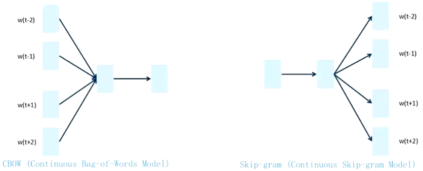

# 词向量

对基本语义单元（token）进行数字化。

## One-Hot

将token映射到高维01向量上：[1, 0, 0, $\cdots$\], [0, 1, 0, $\cdots$]

**缺点：所有向量都是标准正交基，内积都为0，无法表示词之间的语义关系。**

## Tokenizer

将token映射到一维数组上：[1, 2, 3, $\cdots$]

**缺点：表示过于密集，对应索引无意义，无法进行计算，同样无法表示词之间的语义关系。**

# Word2Vec, Word-Embedding

解决表示单个token的语义问题（都是获取词向量矩阵）。

Word2Vec两种模型：

# ELMo

通过双向LSTM获取句法特征和语义特征解决词向量一词多义问题。

# Attention

**优点：**

1. 解决了长序列依赖问题；
2. 可以并行计算；

**缺点：**

1. 开销变大；
2. 词之间没有顺序关系；

组合token的语义问题（即句法特征和语法特征）。

V矩阵就相当于客观语义，A'(softmax(QK/根号d))相当于因为上下文关系而产生的权重大小，Z(A'V)相比较V拥有了句法特征和语法特征。

用了QK内积进行的是相似度计算。

## Self-Attention

QKV矩阵是同源的。

## Masked-Attention

序列生成时，无法获取后续步骤的词向量，因此逐步获取词向量。

## Multi-Head Self-Attention

Z相对于V拥有了句法特征和语法特征，通过Multi-Head Self-Attention，Z'相对于Z又有了进一步提升。

把词向量切分成八块，分别做QKV变换，得到8个Z，最后对Z进行降维。

# 位置编码

解决Self-Attention的无序问题。
